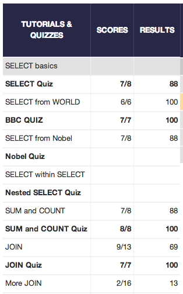

## U3.W7: SQLZoo

####I worked on this challenge by myself

### My Quiz Results:
<!-- Include the link to your image (saved in the imgs folder) to display it inline. -->

### Reflection

Sometimes learning a new thing is incredibly frustrating. SQL was no exception. I cannot reiterate how frustrated I was with SQL initially. The syntax was so straight forward that it actually bugged me, which bugged me more. Honestly. After a little while, when I settled down and focused on the intricacies, I fell into a more comfortable groove, and now I can see the positives of using SQL. 

One thing that did bug me, however, was this website. There were a handul of issues that I found, and they drove me nuts. A few times, I thought I was doing everything wrong, but it turns out the website was being a little silly. 

As far as learning objectives, I think I am okay. I have more work to do (like complex joins), but with some more practice through the week, I will be able to hand basic SQL.