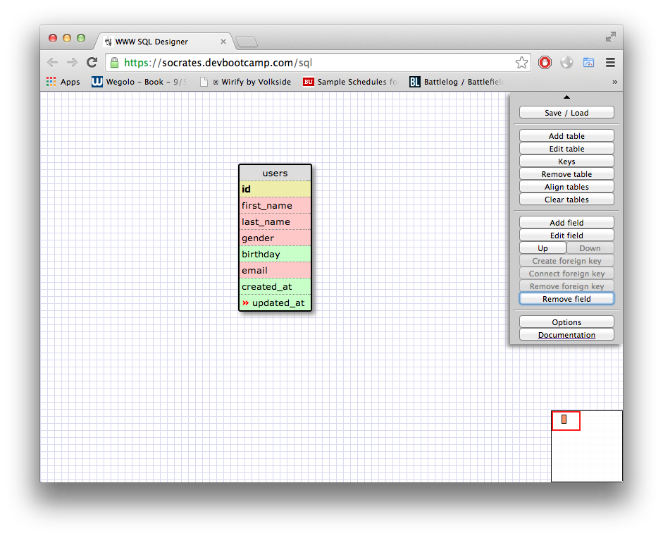
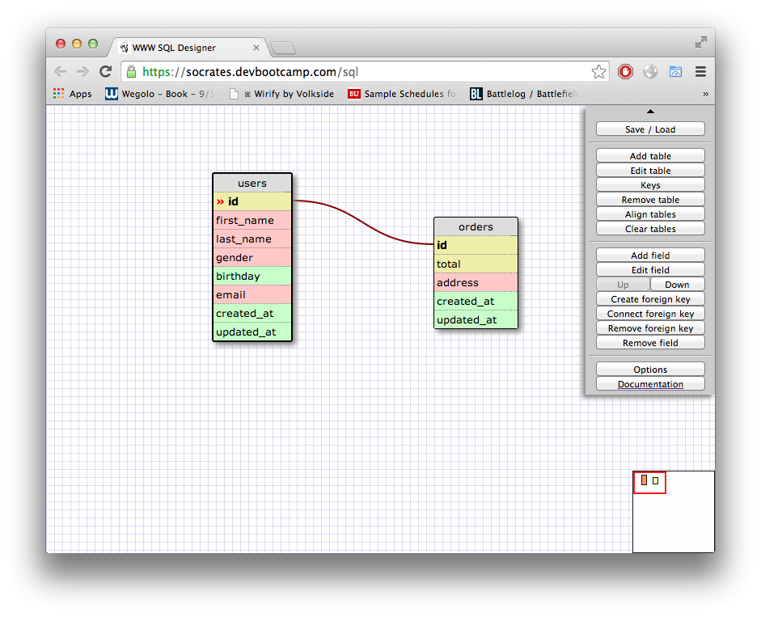
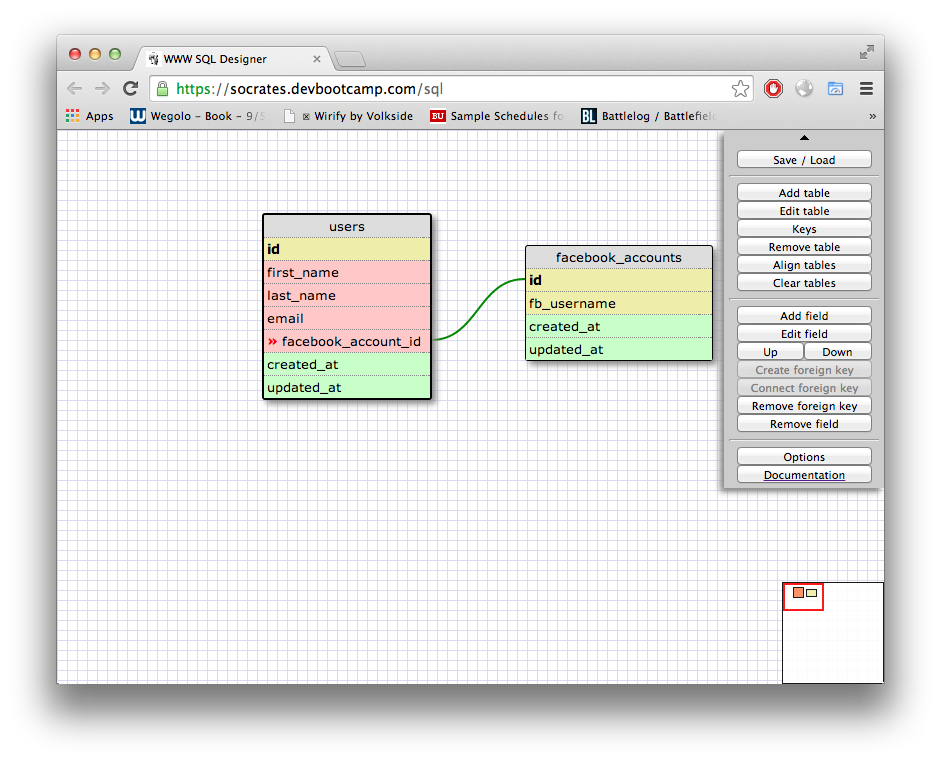
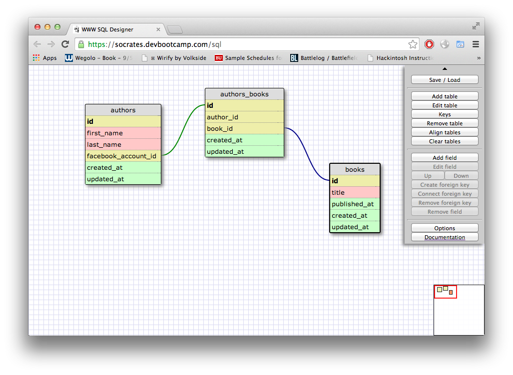
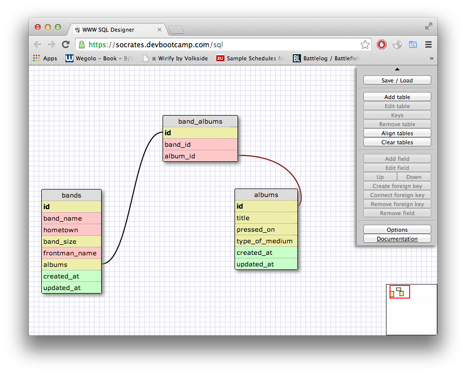

# U3.W7: Designing Schemas

#### I worked on this challenge [by myself, with: ]

## Release 0: Student Roster Schema
<!-- display your image inline here -->

## Release 1: One to Many Schema
<!-- display your image inline here -->

## Release 2: One to One Schema
<!-- display your image inline here -->

## Release 3: Many to Many Schema
<!-- display your image inline here -->

## Release 4: Design your own Schema
Description of what you're modeling: 

Many-to-many: modeling a band and an album released

<!-- display your one-to-one image inline here -->
<!-- display your many-to-many image inline here -->
![Five] (imgs/thoughts.jpg)

One-to-many: modeling a person's thoughts

## Release 5: Reflection

I liked this exercise quite a bit - it really helped me model what my SQL statements would target. Without this, I think it would be incredibly difficult to target certain things with statements. It was difficult at first to find which foreign keys belonged where, but after some practice, I think I have it down. Another concern I had was gettin the proper formatting down - like created and updated. It was frustrating to have to redo entire tables on the designer when I screwed up a key link. Maybe there was an easier way to do it, but I did not find it.

Overall, I feel fairly confident in the objectives for this assignment.