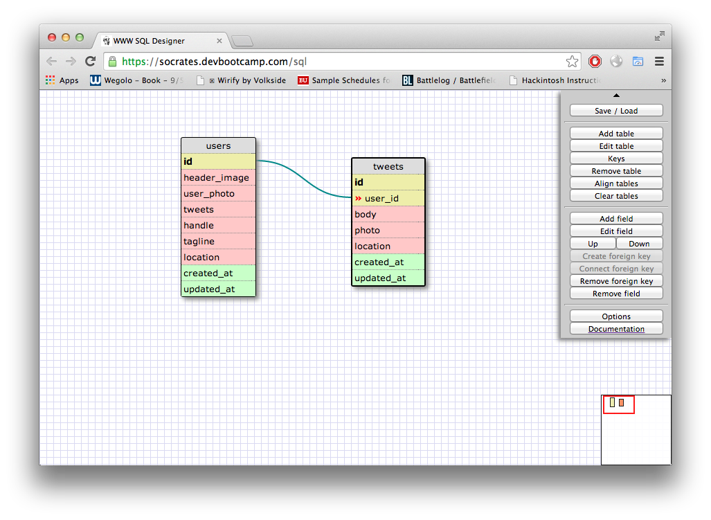

# U3.W7: Modeling a Real-World Database (SOLO CHALLENGE)

## Release 0: Users Fields
<!-- Identify the fields Twitter collects data for -->
<ul>
	<li>Header image</li>
	<li>photo</li>
	<li>name</li>
	<li>tagline</li>
	<li>handle</li> 
	<li>location</li>
</ul>

## Release 1: Tweet Fields
<!-- Identify the fields Twitter uses to represent/display a tweet. What are you required or allowed to enter? -->
<ul>
	<li>Body</li>
	<li>Photo</li>
	<li>Location</li>
</ul>

## Release 2: Explain the relationship
The relationship between `users` and `tweets` is: one-to-many
<!-- because... -->
Users have many tweets, but a tweet only has one user.

## Release 3: Schema Design
<!-- Include your image (inline) of your schema -->

## Release 4: SQL Statements
<!-- Include your SQL Statements. How can you make markdown files show blocks of code? -->

* all the tweets for a certain user id

	SELECT tweets.id, body FROM users JOIN tweets ON users.id = user_id  
	WHERE **user.id = whatever specific ID**  

* the tweets for a certain user id that were made after last Wednesday (whenever last Wednesday was for you)
	
	SELECT body FROM users JOIN tweets ON users.id = user_id  
	WHERE user_id = ** USER ** AND tweets.created_at > 2014-04-24  

* all the tweets associated with a given user's twitter handle
	
	SELECT tweets.id, body FROM users JOIN tweets ON users.id = user_id  
	WHERE handle = ** HANDLE **  

* the twitter handle associated with a given tweet id
	
	SELECT handle FROM users JOIN tweets ON users.id = user_id  
	WHERE tweets.id = ** DESIRED TWEET ID **  

## Release 5: Reflection
<!-- Be sure to add your reflection here!!! -->